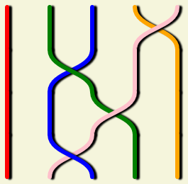

Un notebook pour dessiner des éléments du groupe de tresse (Artin braid group). C'est ipycanvas qui est utilisé pour dessiner sur le canvas HTML5.

Exemple :

Accéder au notebook : 

Mon livre de chevet sur les tresses : "Le calcul des tresses", Patrick Dehornoy, Calvage & Mounet, Collection.-Nano
